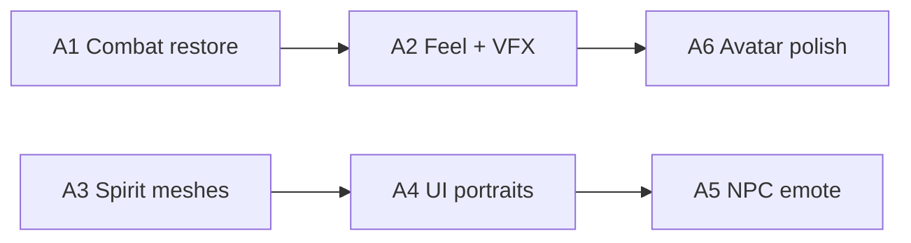

# Animation & Character Art Block — план (2026-08-28)

> **Режим:** DEV-ONLY (PlaceId=0) · **Publish не требуется** для большинства работ  
> **Place SoT:** `C:\Mimo\RealmOfSpirits\RealmOfSpirits second.rbxl` (не в git)  
> **Старт блока:** только по явной команде **«A1»** / **«анимации»** / **«Anim block»** — **не** заменяет default next (post-W18 regression + owner hands E2E)  
> **Связанные доки:** [`COMBAT-ANIMATIONS.md`](COMBAT-ANIMATIONS.md) · [`RESEARCH-AI-ANIM-ART-2026-08-28.md`](RESEARCH-AI-ANIM-ART-2026-08-28.md) · [`OWNER-SETUP-PAID-AI.md`](OWNER-SETUP-PAID-AI.md) · [`SPIRIT-AI-MESH.md`](SPIRIT-AI-MESH.md) · [`KAMI-SANCTUM.md`](KAMI-SANCTUM.md) · readiness §6 в [`NEXT-SESSION.md`](NEXT-SESSION.md)

---

## Executive summary

Блок **A1–A6** закрывает **visual polish**, который двигает **readiness #6 (Polish threshold)** и ощущение core loop (бой → дух → Sanctum), **без** Publish, Allow* flip и online AI mesh. Сейчас body sword-swing **отключён** (`CombatAnimResolver.ShouldPlayBodyAnim → false`); остаются blade tween, root lunge и `pulseCombatFeedback`. Агент максимально полезен на: восстановлении клипов + resolver smoke, тюнинге таймингов, офлайн-мешах (Blender → Open Cloud → `insert_asset`), Studio MCP правках UI/Viewport и Play-smoke. **Руки владельца** нужны для: публикации **собственных** Animation через Animation Editor, rigging non-R15, одобрения Marketplace/Creator Store ассетов и финального «нравится / не нравится» по DG-feel.

**Приоритет срезов:** бой (A1–A2) → читаемость духов (A3–A4) → хаб/NPC (A5) → аватар/аксессуары (A6).

---

## Goals

| # | Цель | Связь с readiness |
|---|------|---------------------|
| G1 | Вернуть **читаемые body-анимации** атаки (free verified IDs или owner-provided) | Core loop feel · ROADMAP «Combat feel» |
| G2 | Согласовать blade tween + lunge + body track (без регрессии `ClientController`) | P0 UX в бою |
| G3 | Улучшить **silhouette / mesh** приоритетных духов (офлайн, не online AI) | Sanctum LOOK · spawn readability |
| G4 | Полировать **UI portraits** (Sanctum Viewport, battle slots, icons) | Identity / Resonant path |
| G5 | Лёгкие **NPC emote** (Мика) без full 2D-Live marathon | Hub polish · GDD Beta |
| G6 | Документировать AnimationId workflow и smoke-рецепты для агента | Повторяемость сессий |

## Non-goals

- Publish place · live cutover · Allow* flip
- **Online AI mesh** (`SpiritMeshGenerationService`, `PromptCreateAssetAsync`) — см. [`SPIRIT-AI-MESH.md`](SPIRIT-AI-MESH.md)
- Proprietary **Dueling Grounds** clips без лицензии / Team Create
- Haven décor marathon · B1 PvP · Side 106 «Цикл стихий»
- Custom rig / IK для всех 32 форм
- E1 formal n≥10 как gate блока (может идти параллельно owner hands)

---

## Текущее состояние (baseline)

| Область | Состояние | SoT |
|---------|-----------|-----|
| Combat body anim | **Disabled** — `Play()` no-op, `CombatAnimations/` удалены из place | `CombatAnimResolver.lua` mirror · [`COMBAT-ANIMATIONS.md`](COMBAT-ANIMATIONS.md) |
| Combat feel (partial) | Blade Motor6D tween + HRP lunge + hint/flash/camera punch | `ClientController.lua` · resolver timing kinds |
| Spirit locomotion | Procedural walk/fly/swim (`SpiritAnimation`) | `SpiritAnimation.lua` · `GameManager` |
| Spirit meshes | Канон 4×4 в `SpiritTemplates` (офлайн); Resonant = parent clone / placeholder | [`SPIRIT-AI-MESH.md`](SPIRIT-AI-MESH.md) |
| NPC / emote | QuestMaster (Мика) — диалог GUI; 2D-Live **Planned** Beta | `GDD.md` § Otaku Haven сценарий |
| UI portraits | Sanctum `LookPreview` ViewportFrame; battle icons via `IconLookupId` | [`KAMI-SANCTUM.md`](KAMI-SANCTUM.md) |

---

## Срезы A1–A6

| Срез | Название | Фокус | Длительность | Exit criteria (PASS) |
|------|----------|-------|--------------|----------------------|
| **A1** | Combat body restore | `CombatAnimations/` + resolver `Play`/`Verify` + free IDs | ~3–5 agent sessions | `VerifyAllClips` 6/6 Length>0 · skills **1/119/31/11/2** smoke · body track `IsPlaying` @50ms · **Ctrl+S** |
| **A2** | Combat feel + VFX | DG-tuned timing · element hit feedback · optional heavy arc | ~2–4 sessions | 5 `AnimKind` smoke PASS · lunge readable (2.4/4.2 stud) · hint «Удар!»/«Выпад!» · no Output errors in battle |
| **A3** | Spirit silhouette pass | 8 hero meshes (1 base per Primary ×2) — Blender/Studio offline | ~1–2 weeks | 8× `SpiritTemplate{Id}` updated · spawn smoke · `IsMeshPlaceholder=false` · mirrors + asset FBX local |
| **A4** | UI portrait polish | Sanctum Viewport camera/light · battle slot icons · carousel | ~3–5 sessions | Sanctum LOOK smoke (name+3★+vid+mesh) · battle UI icons distinct at 64px · docs SESSION note |
| **A5** | NPC emote lite | Мика: greet / sweat / point (Billboard or simple anim) | ~2–3 sessions | Quest accept flow shows ≥3 visual states · no ProximityPrompt regression |
| **A6** | Avatar & accessories | RealmBlade mesh read · optional keeper accessory · R15/R6 check | buffer / optional | Blade readable 3rd person in combat · R6 fallback slash still OK · owner sign-off |

### Зависимости и порядок



- **A1 перед A2:** body tracks должны существовать до fine-tuning lunge/blade.
- **Animation IDs перед wiring:** folder `CombatAnimations/*.AnimationId` → затем `ShouldPlayBodyAnim(true)` → затем `ClientController` timing unchanged.
- **A3 перед A4:** Viewport показывает обновлённые меши.
- **A5** не блокирует readiness #6; можно отложить после A1–A4.
- **Параллельно owner hands E2E** (Prep/Complete/Exit) — блок не отменяет default regression.

---

## Paid stack (owner selected)

> **Решение владельца (2026-08-28):** платный tier для Anim/Char Art. Детали research: [`RESEARCH-AI-ANIM-ART-2026-08-28.md`](RESEARCH-AI-ANIM-ART-2026-08-28.md) · one-time setup: [`OWNER-SETUP-PAID-AI.md`](OWNER-SETUP-PAID-AI.md)

### Primary — minimal paid (~$12/mo)

**Покупать не всё сразу.** Максимальный ROI: один mesh-инструмент + бесплатный A1.

| Инструмент | $/мес | Signup | Срезы | Зачем |
|------------|-------|--------|-------|-------|
| **Tripo Professional** (annual) | **~$12** | [tripo3d.ai/pricing](https://www.tripo3d.ai/pricing) | **A3** (primary) · **A6** spillover | Commercial FBX/GLB · Smart Low Poly · замена Hunyuan/Rodin для hero meshes |
| Verified Roblox IDs | **$0** | — | **A1** | `522635514` / `522638767` / `129967390` — native R15, без подписки |
| Agent code tuning | **$0** | — | **A2** | KIND_CONFIG · lunge · VFX — AI не нужен |
| ComfyUI local (SD/Flux) | **$0** | — | **A4** | Портреты без Leonardo, пока GPU есть |
| Mixamo + Rokoko text-to-motion (free) | **$0** | [mixamo.com](https://www.mixamo.com) · [rokoko.com](https://www.rokoko.com) | **A5** | Emote backup до платного mocap |

**Итого minimal paid: ~$12/мес** (только Tripo Pro).

### Optional add-ons (по мере срезов)

| Когда | Инструмент | $/мес | Signup | Срез |
|-------|------------|-------|--------|------|
| Free IDs не дают нужный DG-feel | **UGCraft Creator** | **+$9** | [ugcraft.ai](https://www.ugcraft.ai/creation/roblox-animation-maker) | **A1** custom R15 combat clips |
| Нет local ComfyUI / нужны private portraits | **Leonardo Essential** | **+$12** | [leonardo.ai/pricing](https://leonardo.ai/pricing) | **A4** Sanctum + battle icons |
| A5 нужен video mocap volume | **Rokoko Basic** | **+$10** | [rokoko.com/pricing](https://www.rokoko.com/pricing) | **A5** NPC emote mocap |

### Alternative bundles

| Bundle | Состав | $/мес | Для кого |
|--------|--------|-------|----------|
| **Minimal** (recommended) | Tripo Pro only | **~$12** | A3 commercial mesh · A1 free IDs · A4 ComfyUI |
| **Growth** | Tripo + UGCraft + Leonardo | **~$33** | Custom combat clips + mesh + private portraits |
| **Full paid** | Growth + Rokoko Basic | **~$43** | Все A1–A5 с платными инструментами · A2/A6 без отдельной подписки |
| **Not recommended** | Rodin API Business | **$120** | Только если quad+HD критичны; Hunyuan/Tripo достаточно для 8 silhouettes |

### Порядок покупки

1. **Сейчас:** ничего — старт **«A1»** на free IDs ($0).
2. **Перед A3:** оформить **Tripo Pro** (commercial license до publish).
3. **После A1 PASS**, если feel слабый: **UGCraft Creator** ($9).
4. **На A4**, если нет ComfyUI: **Leonardo Essential** ($12).
5. **Отложить:** Rokoko Basic до A5 · Rodin до явного quality gap.

### Первая команда агенту

| Ситуация | Команда |
|----------|---------|
| Старт блока (день 1, без подписок) | **«A1»** — combat restore на verified free IDs |
| Tripo оформлен, hero meshes | **«A3 Tripo»** или **«A3»** — Id=1 Fire Cat pipeline smoke |
| Custom clips после слабого A1 | **«A1 UGCraft»** — text→R15 → owner publish → wire IDs |

### Agent automation (paid tools)

| Инструмент | Агент может | Агент не может |
|------------|-------------|----------------|
| **Tripo Pro** | Prompt brief · web gen (semi-manual download) · Blender decimate · `roblox_upload_model.py` · Studio `insert_asset` | Оплата · API key в Tripo (web-only на Pro) · subjective mesh approval |
| **UGCraft Creator** | Prompt text · import `.rbxm`/FBX в Studio · wire `FALLBACK_IDS` после publish | Web login · billing · **publish Animation → rbxassetid** (owner) |
| **Leonardo Essential** | Prompt batch · API на paid (если owner дал key) · wire `IconLookupId` | Account signup · billing · Decal upload moderation |
| **Rokoko Basic** | Retarget pipeline в Blender · import FBX | Video capture · subscription · desktop app GUI |
| **Open Cloud** (уже может быть) | `roblox_upload_model.py` · `insert_asset` | API key creation · secrets in git |

---

## Agent playbook (общий)

### Skills (обязательный порядок)

1. [`realm-orchestrator`](../../.cursor/skills/realm-orchestrator/SKILL.md) — маршрутизация, не смешивать с owner unlock
2. [`realm-studio-mcp`](../../.cursor/skills/realm-studio-mcp/SKILL.md) — правки place, cache bust, export mirrors
3. [`realm-mesh-from-prompt`](../../.cursor/skills/realm-mesh-from-prompt/SKILL.md) — A3/A6 mesh pipeline
4. [`luau-roblox-style`](../../../.cursor/skills/luau-roblox-style/SKILL.md) — strict Luau при правках resolver/ClientController

### MCP tools по типу задачи

| Задача | Namespace | Tools |
|--------|-----------|-------|
| Read/edit modules | `user-Roblox_Studio` | `get_studio_state`, `script_read`, `multi_edit`, `script_grep` |
| Play smoke | `user-Roblox_Studio` | `start_stop_play`, `execute_luau`, `get_console_output`, `user_keyboard_input` (V, Keypad1–3) |
| Verify animations | `user-Roblox_Studio` | `execute_luau` → `CombatAnimResolver.VerifyAllClips` / `LoadAnimation` Length |
| Search free anims | `user-Roblox_Studio` | `search_asset` (Category Animation) — **только** после `VerifyClip` Length>0 |
| Insert mesh | `user-Roblox_Studio` | `insert_asset` → parent `ReplicatedStorage.SpiritTemplates` |
| Generate mesh fallback | `user-Roblox_Studio` | `generate_mesh` (если Blender недоступен — **disclose**) |
| Blender mesh | `user-blender` | `generate_hyper3d_model_via_text`, `poll_rodin_job_status`, `import_generated_asset`, `execute_blender_code` |
| Upload FBX | Shell | `python scripts/roblox_upload_model.py …` |
| Docs / gate | Shell | `python scripts/quality_gate.py` |

### Стандартная сессия агента (любой срез A*)

1. **Ctrl+S** reminder · `get_studio_state`
2. `script_read` affected modules · сравнить с mirror `docs/realm-of-spirits/studio/`
3. Implement via `multi_edit` · **cache bust** ModuleScripts
4. `start_stop_play` → smoke recipe среза
5. `get_console_output` — no red
6. Export mirrors · `CHANGELOG.md` `[Unreleased]` (если код менялся)
7. **Ctrl+S** place

### Play smoke recipes

**A1/A2 combat:**

```luau
-- Client Play: после атаки skill 1 и 119
local R = require(game.ReplicatedStorage.RealmOfSpirits.CombatAnimResolver)
for name, row in R.VerifyAllClips(game.Players.LocalPlayer.Character.Humanoid) do
    print(name, row.ok, row.length)
end
-- MCP: V + Keypad1 (skill 1), Keypad2 (skill 2 if mapped)
```

**A3 mesh:**

```luau
local M = require(game.ReplicatedStorage.RealmOfSpirits.SpiritMeshResolve)
local m = M.CloneResolvedModel({ Id = 1 })
print(m:GetAttribute("IsMeshPlaceholder"), m.Name)
```

**A4 Sanctum:** smoke per [`SESSION-2026-08-14-sanctum-look-sot.md`](SESSION-2026-08-14-sanctum-look-sot.md)

---

## Agent playbook по срезам

### A1 — Combat body restore

| Шаг | Кто | Действие |
|-----|-----|----------|
| 1 | Agent | Восстановить `ReplicatedStorage.RealmOfSpirits.CombatAnimations/` (6× `Animation` instances: SlashR15, LungeR15, SpellTapR15, SpellImpulseR15, RangedShotR15, SlashR6) |
| 2 | Agent | Восстановить полный `CombatAnimResolver`: `DG_CLIPS`, `FALLBACK_IDS`, `Play`, `VerifyClip`, `VerifyAllClips`, `ShouldPlayBodyAnim → true` — ориентир: CHANGELOG 2026-08-23 + [`COMBAT-ANIMATIONS.md`](COMBAT-ANIMATIONS.md) |
| 3 | Agent | IDs: **`522635514`** / **`522638767`** / **`129967390`** (verified free) |
| 4 | Agent | Убедиться `ClientController.playPlayerAttackAnimation` вызывает `Play()` **до** долгого `waitForBladeModel` (fix уже описан в COMBAT-ANIMATIONS) |
| 5 | Agent | Play smoke 1/119/31/11/2 · export mirror · CHANGELOG |
| 6 | Owner (opt.) | Если нужен DG-feel: предоставить licensed AnimationId или Team Create extract |

### A2 — Combat feel + VFX

| Шаг | Кто | Действие |
|-----|-----|----------|
| 1 | Agent | Tune `KIND_CONFIG` speeds/lunge per COMBAT-ANIMATIONS DG table |
| 2 | Agent | `stopConflictingTracks` + `AdjustWeight(1)` если idle masks body |
| 3 | Agent | Element-colored `pulseCombatFeedback` / blade trail hooks (minimal, `EffectCatalog` colors) |
| 4 | Agent | MCP battle loop: Mika path → Exit → combat → 3 skills |
| 5 | Owner | Subjective «feel OK» — не блокер автоматизации |

### A3 — Spirit silhouette pass

| Шаг | Кто | Действие |
|-----|-----|----------|
| 1 | Agent + Owner | Выбрать 8 Id (proposal: **1, 2, 3, 6, 7, 9, 11, 16** — по одному readable base per Primary + 2 signature) |
| 2 | Agent | Prompt brief per spirit (aspect, silhouette keywords) → **Blender Rodin** OR `generate_mesh` fallback |
| 3 | Agent | `blender_export_for_roblox.py` → `roblox_upload_model.py` → `insert_asset` → rename `SpiritTemplate{N}` |
| 4 | Agent | Scale/collision pass in Studio · spawn smoke in MistPond/Akihabara |
| 5 | Owner | Approve mesh «канон» vs iterate prompt |

**Hero mesh queue (default proposal):**

| Id | Дух | Зачем |
|----|-----|-------|
| 1 | Огненный Кот | Fire core · частый spawn |
| 2 | Ледяная Птица | Ice · fly type |
| 3 | Теневой Пёс | Dark · hunt tutorial |
| 6 | Водный Карп | Water · swim |
| 7 | Каменный Голем | Earth tank silhouette |
| 9 | Ветряной Лис | Wind core |
| 11 | Лунный Кролик | Moon · Sanctum showcase |
| 16 | Лавовый Краб | Magma · heavy read |

### A4 — UI portrait polish

| Шаг | Кто | Действие |
|-----|-----|----------|
| 1 | Agent | `script_read` Sanctum UI modules · ViewportFrame WorldModel lighting |
| 2 | Agent | Camera CFrame + `Ambient`/`LightColor` for `LookPreview` |
| 3 | Agent | Battle `UIController` icon sizing/contrast · `IconLookupId` consistency |
| 4 | Agent | Resonance carousel framing if applicable |
| 5 | Agent | SESSION smoke note |

### A5 — NPC emote lite

| Шаг | Кто | Действие |
|-----|-----|----------|
| 1 | Agent | BillboardGui 3-state sprite OR NPC `Animation` with free emote IDs |
| 2 | Agent | Wire Quest accept / dialog steps in QuestMaster flow |
| 3 | Owner | Publish custom emote animations if not using free Marketplace |
| 4 | Agent | Play: ProximityPrompt → 3 visual beats |

### A6 — Avatar & accessories

| Шаг | Кто | Действие |
|-----|-----|----------|
| 1 | Agent | RealmBlade mesh refine (Blender or Studio) · Motor6D alignment |
| 2 | Owner | Equip test on owner avatar R15 |
| 3 | Agent | R6 `SlashR6` smoke · accessory collision check |
| 4 | Agent | Optional keeper cloak/hair — **Creator Store** insert requires owner approval |

---

## Owner hands (не делегируется агенту)

| Задача | Почему owner | Когда |
|--------|--------------|-------|
| **Publish Animation** from KeyframeSequence | Roblox Creator Hub → Animation upload → rbxassetid | Custom clips (не free set) |
| **Animation Editor** keyframe authoring | Hands-on timing / style | DG-alternative clips |
| **Rigging** custom NPC/spirit bones | Studio Avatar rigging | Non-procedural spirit anims |
| **Marketplace / Creator Store purchase** | Account billing + license | Premium emote packs |
| **Team Create** on DG place | Legal + access | Proprietary DG IDs |
| **Rodin API funds** | Hyper3D billing on Windows | Blender mesh gen |
| **Open Cloud API key** | Secrets · one-time setup | FBX upload pipeline |
| **Visual sign-off** | Art direction | Each A3 mesh · A5 emote |
| **Ctrl+S** | Place SoT not in git | Every session |

---

## Risk / friction table

| Risk | Impact | Mitigation | Owner? |
|------|--------|------------|--------|
| Rodin `API_INSUFFICIENT_FUNDS` | A3 blocked in Blender | Studio `generate_mesh` fallback · sculpt in Blender without Rodin · disclose in SESSION | Owner funds / fallback |
| R15 vs R6 avatars | Wrong slash clip | Keep `SlashR6` + `ResolveKind` · test both in Play | Agent smoke |
| Animation Length = 0 | Silent fail in battle | **Never** wire ID without `VerifyClip` · COMBAT-ANIMATIONS denylist | Agent |
| Idle/tool tracks mask Action4 | Body anim «invisible» | `stopConflictingTracks` (documented fix) | Agent |
| `CombatAnimations/` deleted again | Regression to no-op | A1 restores + mirror sync + smoke in quality habits | Agent |
| Open Cloud moderation delay | `insert_asset` fails | Poll/retry · local FBX kept | Agent wait |
| Custom rig on spirits | Keyframe anims don't fit | Stay on `SpiritAnimation` procedural for world spirits; body anims **player only** | Design |
| DG proprietary IDs | Legal + Length 0 | Free Linked Sword set · owner license path | Owner |
| MCP can't send F/1/2 | False «broken combat» | Use **V** + Keypad1–3 per realm-studio-mcp | Agent |
| Parallel with E2E hands gaps | Split focus | Block starts only on «A1»; regression stays default | Process |
| Over-scoping A5 2D-Live | Weeks of UI art | A5 = 3 emote states max · full GDD Beta deferred | Scope guard |

---

## Integration with readiness #6 (Polish threshold)

From [`NEXT-SESSION.md`](NEXT-SESSION.md) § Readiness:

> **#6 Polish threshold** — нет открытых P0 UX/blocker; named backlog (106, B1, décor) — не блокер soft launch  
> **Сейчас:** ☐ CONDITIONAL — E1 n≥10 таблица пуста; side 106/B1 open

| Block contribution | Readiness effect |
|--------------------|------------------|
| **A1–A2 PASS** | Closes ROADMAP gap «Combat feel» · reduces P0 UX «бой не читается» |
| **A3–A4 PASS** | Sanctum / spawn **look** closer to shippable · supports #5 core loop «понятно что за дух» |
| **A5–A6 PASS** | Nice-to-have for #6 · not required for PASS if A1–A4 green |
| **Does NOT replace** | E1 n≥10 · owner hands Prep/Complete/Exit · #2 regression suite |

**Suggested readiness narrative after block:**

- Minimum for #6 bump: **A1 + A2 PASS** + no new P0 in combat smoke
- Strong #6: **A1–A4 PASS** + owner accepts mesh/icon direction
- Full polish: A1–A6 (optional A5/A6)

---

## DEV-ONLY compatibility

| Work | Needs Publish? |
|------|----------------|
| Use free rbxassetid animations | **No** — load by ID in unpublished place |
| Studio Animation instances in `CombatAnimations/` | **No** |
| Owner-published Animation to user inventory | **No** for Studio Play testing |
| Open Cloud Model upload | **No** for dev insert (moderation may delay) |
| Marketplace emote purchase | **No** for Studio test (asset must be owned) |
| Live player-facing anim CDN edge cases | Rare; smoke in unpublished sufficient for dev |

---

## Verification checklist (block exit)

- [ ] A1: `VerifyAllClips` 6/6 OK in Play
- [ ] A2: 5 skill kinds MCP smoke PASS
- [ ] A3: 8 templates non-placeholder spawn OK
- [ ] A4: Sanctum LOOK + battle icons SESSION PASS
- [ ] A5: 3 NPC emote states on quest flow (optional)
- [ ] A6: RealmBlade readable · R6/R15 OK (optional)
- [ ] Mirrors synced · CHANGELOG updated · `quality_gate.py` green
- [ ] Place **Ctrl+S** · readiness #6 re-assessed in NEXT-SESSION

---

## Command routing

| User says | Agent starts |
|-----------|--------------|
| **«A1»** / **«анимации»** / **«combat anim restore»** | **A1** — this doc § A1 playbook |
| **«A2»** … **«A6»** | Corresponding slice |
| **«Anim block status»** | Read this doc + last SESSION-A* note |
| **«дальше»** (no qualifier) | **NOT** this block — post-W18 regression per NEXT-SESSION |

---

## Related files

| File | Role |
|------|------|
| [`COMBAT-ANIMATIONS.md`](COMBAT-ANIMATIONS.md) | Clip IDs · categories · troubleshooting |
| [`studio/CombatAnimResolver.lua`](studio/CombatAnimResolver.lua) | Mirror (currently stripped / body disabled) |
| [`studio/ClientController.lua`](studio/ClientController.lua) | Attack pipeline · feedback |
| [`studio/SpiritAnimation.lua`](studio/SpiritAnimation.lua) | Procedural spirit motion |
| [`SPIRIT-AI-MESH.md`](SPIRIT-AI-MESH.md) | Offline mesh policy |
| [`RESEARCH-AI-ANIM-ART-2026-08-28.md`](RESEARCH-AI-ANIM-ART-2026-08-28.md) | Tool pricing · tier comparison |
| [`OWNER-SETUP-PAID-AI.md`](OWNER-SETUP-PAID-AI.md) | Paid stack owner checklist |
| [`.cursor/skills/realm-mesh-from-prompt/SKILL.md`](../../.cursor/skills/realm-mesh-from-prompt/SKILL.md) | Blender → Roblox pipeline |

---

*Created: 2026-08-28 · Plan-only · No place edits in this session*
