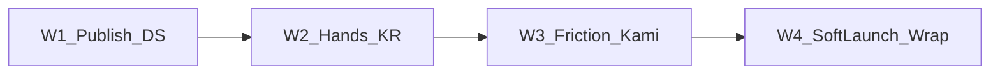

# Realm of Spirits — план на месяц

**Окно:** 2026-08-15 → 2026-09-14  
**Place SoT:** `C:\Mimo\RealmOfSpirits\RealmOfSpirits second.rbxl`  
**Якоря:** `GOALS.md`, `PROJECT-COMPLETION.md`, week wrap `SESSION-2026-08-14f-week-wrap.md`

---

## Где мы сейчас

Код **shippable demo + soft-launch backend** в SoT:

- Resonant loop W1–W4, hands MCP, Dex Resonant, Sanctum Status  
- DataStore `UpdateAsync` + session lock  
- `HubFunnel` (Mika / Prep / ExitCombat)

Остаётся **продукт**, не фичи: W2 hands KR, friction из реальной игры. W1 soft-launch ops **закрыт** (publish + live DS).

---

## Цель месяца (одна фраза)

Игроки (и ведущий руками) стабильно проходят 10-мин цикл Haven→квест→лут/лов→бой→Ками с живым DataStore; метрики e2e и hub funnel читаются без MCP-костылей.

**Фокус:** закрыть soft-launch (фаза 2) и P0 play-test KR. Фазу 3 (PvP / AI mesh) **не начинать** — только gate-checklist в конце, если KR зелёные.

---

## Вне scope (жёстко)

| Не делаем | Почему |
|-----------|--------|
| Online AI mesh | Deferred (`SPIRIT-AI-MESH.md`) |
| Новая PvP / guilds разработка | После P0 KR1–KR2 |
| Крупный декор Haven / огромные зоны | Не блокер soft-launch |
| Переписывание на ProfileService | Оставляем raw `DataStoreManager` |

---

## Exit criteria месяца

| # | Критерий | Статус |
|---|----------|--------|
| **M1** | Publish + DS round-trip + quality_gate + 1 hands smoke | **PASS** 15.08d — PlaceId=`130832500076229`; DS rejoin OK |
| **M2** | E1 sample ≥5 рук + HubFunnel день + backlog friction | **PASS CONDITIONAL** 15.08e — 5× MCP бой + HubFunnel Complete; backlog 3 |
| **M3** | Топ-3 P0 закрыты + Kami hands без ForceCatch + agency 2+ skills | pending |
| **M4** | Month wrap + E1 вердикт + фраза на октябрь + gate фазы 3 | pending |

---

## W1 — 15–21.08 · Soft-launch ops

| # | Exit | Как проверить |
|---|------|----------------|
| **M1.1** | Place **published** + API Services | **PASS** — PlaceId=`130832500076229` GameId=`10713581476` |
| **M1.2** | DataStore round-trip | **PASS** — ForceCatch→Stop→Play; spirits=2 Exp=50 |
| **M1.3** | `quality_gate.py` зелёный | **PASS** 2026-08-15d |
| **M1.4** | 1 hands smoke (не n≥10) | **PASS live-like MCP** — бой победа + HubFunnel Mika/Exit; `SESSION-2026-08-15d-month-w1-ops.md` |

**Done when:** M1.1–M1.4 отмечены PASS или явный блокер ops.

---

## W2 — 22–28.08 · Play-test KR

| # | Exit | Как проверить |
|---|------|----------------|
| **M2.1** | E1 sample ≥5 рук (к ≥90% n≥10 — позже) | **PASS CONDITIONAL** — 5× MCP live-like бой; `SESSION-2026-08-15e-month-w2.md` |
| **M2.2** | HubFunnel: Mika+Prep+ExitCombat за день | **PASS** Complete=true |
| **M2.3** | Список P0 friction из hands | **PASS** — 3 пункта (Wardrobe Prep fixed) |

**Done when:** ≥5 проходов залогированы + backlog из 3+ пунктов или «friction не найден».

---

## W3 — 29.08–04.09 · Friction + Kami hands

| # | Exit | Как проверить |
|---|------|----------------|
| **M3.1** | Топ-3 P0 из W2 закрыты в SoT | Studio + mirror + Ctrl+S + commit |
| **M3.2** | Kami hands-цикл без ForceCatch | синтез→бой слот1→Care→Sanctum `[R]` |
| **M3.3** | Agency: ≥1 бой с 2+ SkillIndex в hands log | GOALS KR3 soft |

**Done when:** M3.1–M3.3 PASS в SESSION.

---

## W4 — 05–14.09 · Soft-launch wrap

| # | Exit | Как проверить |
|---|------|----------------|
| **M4.1** | Таблица M1–M3 + вердикт soft-launch | SESSION month-wrap |
| **M4.2** | E1: ≥90% n≥10 **или** честный CONDITIONAL + план | не раздувать scope |
| **M4.3** | Фраза на октябрь + gate фазы 3 | PvP/AI mesh только если KR1–KR2 OK |

**Done when:** wrap в git; `NEXT-SESSION.md` указывает на октябрьскую фразу.

---

## Трекинг

- День: 3–5 строк в `SESSION-2026-08-XX.md` / `SESSION-2026-09-XX.md`  
- Неделя: обновлять статусы таблиц в этом файле  
- Месяц: блок в `CHANGELOG.md` `[Unreleased]`  
- Перед работой: `NEXT-SESSION.md` → этот файл  
- Git: коммитить docs/mirrors после куска; **не** `.rbxl` / `.tmp_extract`

## Связанные доки

- Completion: `PROJECT-COMPLETION.md`  
- Неделя (закрыта): `WEEK-PLAN-2026-08-26.md`  
- Автоматизация: `AUTOMATION.md`
