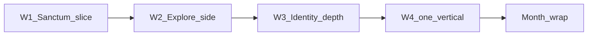

# Realm of Spirits — план на месяц (dev-first)

**Окно:** 2026-09-01 → 2026-09-28 (4 недели, пн–вс)  
**Якорь:** 2026-08-19 — week wrap 19–25.08 **Done**; Resonant live loop **MCP PASS**; E1 hands **#8 PASS**; код-PASS по ядру  
**Place SoT:** `C:\Mimo\RealmOfSpirits\RealmOfSpirits second.rbxl`  
**Откуда приоритеты:** `GOALS.md` (один major track) + `NEXT-SESSION.md`

---

## Цель месяца (одна фраза)

**Разработка продукта без марафона тестов:** каждая неделя — один узкий срез, который игрок **видит и понимает** (Sanctum → Explore → Identity → один vertical slice), при **80% кода / 20% smoke**, без разрушения целостности place.

---

## Где мы сейчас

| Метка | Смысл |
|-------|--------|
| **E1 hands #8 PASS** | Живой цикл квест→ловля→бой→сдача без P0 |
| **Resonant loop MCP PASS** | Synth → бой F+1/2 → Care → `[R]` в Sanctum |
| **Sanctum unlock** | `MinPlayerLevel` **2**; стартовый осколок **301** |
| **Explore W3 PASS** | Funnel 101/102/120 + сундук ≤4 мин |
| **Identity 1–3 PASS** | Evo slot-1 + LOOK + progress card |
| **E4 / Q3 PASS** | Live 2p trade + duel wayfind |

**Не цель месяца:** Allow*, Guilds, ProfileService live, online AI mesh, декор Haven, параллельно два major track.

---

## Правила целостности (на весь месяц)

| Правило | Простыми словами |
|---------|------------------|
| **Один major track** | Неделя N не начинает тему N+1, пока exit criteria N не зелёные или явно CONDITIONAL с записью |
| **SoT = .rbxl** | Код в Studio → **Ctrl+S**; docs mirrors — зеркало, не замена place |
| **80/20 dev vs smoke** | ~4 дня код/контент, ~1 день короткий smoke (MCP или 1 hands); **не** n≥10 e2e спринт |
| **Не ломать PASS** | Перед merge: один регресс «Мика → Exit → бой → Haven»; если красный — только fix, не новый scope |
| **Git** | Docs/mirrors после осмысленного куска; **не** `.rbxl` / secrets / `.tmp_extract` |
| **Запреты GOALS** | Allow*, Guilds, ProfileService live, online AI mesh, Haven décor — **вне месяца** |

---

## Exit criteria по неделям

| Неделя | Окно | Exit (игрок глазами) | Smoke минимум |
|--------|------|----------------------|---------------|
| **W1** | 01–07.09 | Квест **304** доступен рано; после Accept → Open Sanctum → понятны **осколок + Звёзды**; дезинтеграция без «мёртвых» кнопок | 1× hands: 304 → Open → Preview disintegrate → toast |
| **W2** | 08–14.09 | **1** новая side-цепочка (без новых систем): Accept → лут/зона → TurnIn; трекер не врёт | MCP Play accept→progress→turn-in |
| **W3** | 15–21.09 | Dex Resonant **или** evo-card: игрок видит **эссенции / звёзды** в UI прогресса, не только в Sanctum | 1× synth/disintegrate + карточка/декс |
| **W4** | 22–28.09 | **Один** vertical slice (выбор в пн 22.09): доведён до «можно показать другу» | Smoke по выбранному slice + month wrap |

---

## Неделя 1 — Sanctum product slice (01–07.09)

**Фокус:** онбординг Святилища как **продукт**, не только Resonant loop для QA.

### Что делаем

1. **Quest 304 раньше** — `Level` 10→**3**, prereq story **5**→**{1}** (или **{302}** если цепочка Care→Temper→Stars); Description с **2 ур.** Sanctum (не «с 10 ур.»).
2. **Stars/shard onboarding** — подсказки в `KamiSanctumController` + квестовая реплика Мики; награда 304 (2×310 + 301) читается в сумке (`GetWhyTag` / chip).
3. **Disintegrate UX polish** — preview до confirm; ясный fail «нельзя последнего»; Status не sticky после успеха.

### День за днём (скелет)

| День | Задача |
|------|--------|
| **Пн 01.09** | QuestCatalog **304** + `QuestUI` реплика; sync mirror → Studio; smoke OpenKamiSanctum |
| **Вт 02.09** | Chip/hint: «осколок 301» + «звёзды 310» после квеста 304 |
| **Ср 03.09** | Disintegrate: preview labels (осколки/звёзды/эссенции) |
| **Чт 04.09** | Fail-states + toast-дисциплина (без сырого `copper`) |
| **Пт 05.09** | **Smoke:** 1 hands цикл 304→Open→Synth preview→Disintegrate preview |
| **Сб–вс** | Буфер fix; **не** Explore/PvP |

### Exit W1 — Done when

- Новый игрок **≤15 мин** после Q1 может увидеть 304 в списке Мики (level gate не блокирует).
- Open Sanctum на **2 ур.** + осколок → synth UI не пустой.
- Disintegrate: preview → confirm → loot в инвентаре; последний дух — понятный отказ.

### Вне scope W1

Online AI mesh · PvP · новые зоны · ProfileService · декор Haven.

---

## Неделя 2 — Explore content (08–14.09)

**Фокус:** **одна** side-цепочка контентом, **без** новых систем (reuse VisitZone / CollectItem / WorldLoot).

### Кандидаты (выбрать один в пн 08.09)

| # | Цепочка | Почему |
|---|---------|--------|
| **A** | Side **108–112** scout line (продолжение 107) | Уже есть VisitZone + ScoutQuestor |
| **B** | Side **106** «Цикл стихий» polish + 1 новый pickup | Кристаллы 101/106/107/109 уже в ItemCatalog |
| **C** | Короткая **2-step** side: CollectItem в новой точке на существующем пути Exit→Combat | Минимальный scope |

**Правило:** не добавлять новый `ObjectiveType` — только QuestCatalog + WorldLoot точка + QuestUI строка.

### Exit W2 — Done when

- Accept → progress → TurnIn **PASS** (MCP или 1 hands).
- Лут/зона на карте или chip «следующий шаг».
- Регресс W1 Sanctum не красный.

---

## Неделя 3 — Identity / Resonant depth (15–21.09)

**Фокус:** прогресс **вне** Sanctum UI — игрок понимает, зачем звёзды и эссенции.

### Варианты (один основной)

| # | Срез | Артефакт |
|---|------|----------|
| **A** | **Dex Resonant** — вкладка/строка `[R]` с parent ids + tier звёзд | `SpiritDetail` / Dex UI |
| **B** | **Evo card** — на карточке духа: «для синтеза нужно N звёзд» / эссенция линии | Identity progress card extend |
| **C** | **Disintegrate essences** — после разбора видно 320–323 в сумке с `GetWhyTag` | ItemCatalog + bag only |

### Exit W3 — Done when

- После disintegrate или synth игрок **без гайда** находит, куда смотреть прогресс Resonant/эссенций.
- Не сломан Identity 1–3 (evo slot-1 smoke).

---

## Неделя 4 — один vertical slice (22–28.09)

**Выбор в понедельник 22.09 — только ONE:**

| Slice | Scope | Exit |
|-------|-------|------|
| **PvP slice 3** | Post-duel UX: rematch hint, rank stub, или 1 seasonal cosmetic gate **без** pay combat stats | 2p Local Server 1 duel + toast flow |
| **Explore hub 2** | Haven→Combat **второй** читаемый маршрут (знак + 1 side pickup), не новая зона | ≤5 мин пешком → лут |
| **Sanctum stars meta** | Звёзды 310–312 влияют на preview силы (`ResonancePower` hint) + 1 guided квест шаг `KamiDisintegrate` | Hands: звезда в synth → другой preview |

**Не комбинировать.** Month wrap — **вс 28.09**: таблица W1–W4 + фраза на октябрь.

---

## 80/20 dev vs smoke (как считать)

| Доля | Что входит | Что **не** входит |
|------|------------|-------------------|
| **~80% dev** | QuestCatalog, UI copy, WorldLoot точки, KamiSanctumController, QuestUI, docs mirrors | — |
| **~20% smoke** | 1 MCP Play / 1 hands на exit недели; короткий регресс ядра | n≥10 e2e, полный trade matrix, сезонный баланс |

**Hands ≠ marathon:** один честный прогон с записью PASS/FAIL в `SESSION-2026-09-XX.md` достаточен для exit.

---

## Вне scope (весь месяц)

| Не делаем | Почему |
|-----------|--------|
| **Allow*** / ExpansionGate unlock | Только явная команда владельца |
| **Guilds** | P2 после ядра |
| **ProfileService live** | DataStore session lock достаточен для dev |
| **Online AI mesh** | Deferred; placeholder Resonant OK |
| **Haven décor** | Хаб уже читается; не ROI для dev month |
| **Два major track параллельно** | Размывает 80/20 |
| **E1 n≥10 formal** | Отдельный play-test спринт, не этот месяц |

---

## Риски

| Риск | Mitigation |
|------|------------|
| Ушли в тестирование | Exit = один smoke; остальное — код |
| Quest 304 сломал сортировку Мики | Level 3 + prereq {1}: проверить `QuestUI` sort Level→Id |
| Sanctum fix ломает Resonant loop | Пятничный smoke: synth→`[R]` обязателен |
| Неделя 4 раздулась | Жёстко ONE slice; остальное → backlog октября |

---

## Трекинг

- Каждая неделя: `SESSION-2026-09-XX.md` (3–5 строк, PASS/FAIL по exit).
- Month wrap: блок CHANGELOG `[Unreleased]` + обновить `NEXT-SESSION.md`.
- Перед работой: `NEXT-SESSION.md` → этот файл → при Studio — skill `realm-studio-mcp`.

---

## Month wrap (28.09) — Done when

**Итог одной фразой:** Sanctum onboarding ранний и понятный; мир дал ещё одну side-цепочку; Identity/Resonant виден в UI; один vertical slice готов к показу.

| Exit | Критерий |
|------|----------|
| W1 | 304 + stars/shard + disintegrate UX |
| W2 | 1 side chain PASS |
| W3 | Dex или evo card или essences visibility |
| W4 | ONE slice PASS + docs |

**На октябрь (не решать сейчас):** второй slice из W4 backlog **или** E1 hands buffer **или** Q3 slice 3 — по метрикам month wrap.
