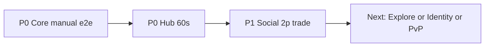

# Realm of Spirits — план на неделю

**Окно:** 2026-08-12 → 2026-08-18 (ср–вт)  
**Якорь сессии:** 2026-08-11 (P0 MCP smoke PASS + audit fixes)  
**SoT place:** `C:\Mimo\RealmOfSpirits\RealmOfSpirits second.rbxl`  
**Источник приоритетов:** `GOALS.md` (сначала оба P0, потом один P1)

---

## Цель недели (одна фраза)

Закрыть **P0 Core loop** по ручному play-тесту (≥5 прогонов без P0-багов) и **P0 Hub** до «60 секунд = магазин», затем одним днём закрыть **P1 Social gate** (2p trade в Safe).

---

## Exit criteria (пятница 15.08 / буфер до 18.08)

| # | Критерий | Как проверить |
|---|----------|----------------|
| E1 | Ручной e2e: Spawn → Mika Q7→Q1 catch → бой F → сдача Q1/Q2 без UI/EndBattle глюков | Чеклист 5× Local Server |
| E2 | В ≥70% боёв тестера нажаты **2+ SkillIndex** (или слот 2/3 доступен и подсвечен) | Наблюдение / короткий лог |
| E3 | Haven: вход → Мика открывается ≤15 с; Exit в Combat понятен; BGM на Safe+Combat минимум | Play 60 с |
| E4 | 2 Players Local Server: обмен item **или** cosmetic в Safe → PASS в CHANGELOG | 1 сессия 2 клиента — **CONDITIONAL** 17–18.08 (SimulateSwap+/tradetest; live 2p open) |
| E5 | Place сохранён (Ctrl+S); NEXT-SESSION актуален; нет открытых Critical из audit | **PASS** docs 18.08; place без Source-правок в день стабилизации |

**Не в scope недели:** online AI mesh, P2 PvP seasons, большой контент новых зон, Tourbillon polish.

---

## День за днём

### Ср 12.08 — P0 Core polish (день 1)

**Фокус:** кайф цикла после MCP smoke.

1. **Ctrl+S** place с утра.
2. Ручной прогон Q7→catch→battle→turn-in ×2; список багов UI/хинтов.
3. Фиксы P0 из списка (EndBattle toast, ловушки HUD, «нет цели», Skill 2/3 visibility).
4. Убрать BOM `user_RoS_ShortGrass` (U+FEFF) из Output.
5. CHANGELOG + SESSION bullet.

**Done when:** 2 ручных e2e без Critical; Output чистый от FEFF.

---

### Чт 13.08 — P0 Core polish (день 2) + agency

**Фокус:** GOALS KR3 — agency в бою.

1. Баланс/UX: подсказки на слоты 2–3; CD/MP читаемы; не блокировать AttackBusy зря.
2. Smoke: бой с ≥2 разными SkillIndex.
3. Повторный e2e ×2 (медиана времени — замерить грубо).
4. Опционально: лёгкий hint у Exit «в Акихабару ловить».

**Done when:** в тестовом бое стабильно жмутся 2+ скилла; нет regress EndBattle.

**Done (2026-08-13):** MaxCooldown + 2-line skill buttons; SkillIndex 1+2 End PASS; Q7+Q1 e2e PASS. Exit hint — skip (не блокер).

---

### Пт 14.08 — P0 Hub как продукт

**Фокус:** первые 60 секунд = аниме-магазин (GOALS P0 Hub).

1. Funnel: Genkan/колокол → Мика (эмоция + Quest UI) → видимый Exit.
2. Аудио: BGM Safe + Combat (и ideally Exit/Akihabara).
3. Убрать/починить то, что ломает «бренд» (пустые указатели, FEFF, спам Output).
4. Play-тест 60 с с «свежим» взглядом; 3 заметки что улучшить.

**Done when:** чеклист Hub (Мика≤15 с, Exit понятен, BGM 2/4+) отмечен в SESSION.

**Done (2026-08-14):** Exit wayfind AlwaysOnTop+KeepVisible (builder + ClientController); Hub intro/Exit toasts; Play smoke Мика≤15 с + Exit prompt + BGM Safe→Combat **PASS**. FEFF ShortGrass = plugin.

---

### Сб 15.08 — P0 gate review + backlog triage

**Фокус:** зафиксировать P0 статус.

1. Сводка: Core + Hub — PASS / CONDITIONAL / FAIL по E1–E3.
2. Если FAIL — только hotfix P0 (не расползаться в фичи).
3. Если PASS — черновик CHANGELOG «P0 play-test gate».
4. Подготовка к Social: напомнить `/tradetest`, Safe zone, 1-slot offer.

**Done when:** явный вердикт P0 в `NEXT-SESSION.md`.

**Done (2026-08-15):** E1 **CONDITIONAL** · E2 **PASS** · E3 **PASS** → итог P0 **CONDITIONAL**. Hotfix нет. CHANGELOG «P0 play-test gate»; triage FEFF/Exit hint/5× manual; prep `/tradetest` для пн. Hub MCP regress PASS. См. `SESSION-2026-08-15.md`.

---

### Вс 16.08 — буфер / контент-лайт

**Фокус:** только если P0 PASS / CONDITIONAL; иначе догон Core/Hub.

- Вариант A (P0 PASS **или CONDITIONAL**): мелкий polish (хинты трекера, иконки Resonant) **или skip → пн Social**.
- Вариант B (P0 FAIL): продолжение фиксов с пятницы.
- Не начинать PvP.

---

### Пн 17.08 — P1 Social gate (2p trade)

**Фокус:** GOALS P1 Social MVP.

1. Local Server → **2 Players**.
2. Оба в Safe; обмен item (ловушка/зелье) **и** отдельно cosmetic если есть.
3. Негативные кейсы: вне Safe / far / empty offer → toast.
4. PASS → CHANGELOG; FAIL → багфиксы `PlayerTradeSystem` / controller.

**Done when:** E4 выполнен или список блокеров с приоритетом.

**Done (2026-08-17):** E4 **CONDITIONAL**. MCP: `SimulateSwap` item/cosmetic + empty/missing reject PASS; `/tradetest` + Request toast PASS; live 2p Local Server **не** закрыт (блокер: MCP Solo). Hotfix нет. См. `SESSION-2026-08-17.md`.
---

### Вт 18.08 — стабилизация + план следующей недели

1. Регресс: короткий P0 e2e + Kami synth (SeedQA) + Showcase E.
2. Docs: SESSION + NEXT-SESSION + WEEK-PLAN retrospect.
3. Выбор следующей недели: Explore loot **или** Identity evo **или** PvP slice (только после Social PASS).

**Done when:** place Ctrl+S; NEXT-SESSION указывает один следующий крупный трек.

**Done (2026-08-18):** MCP regress Q7+Q1+Battle 1+2 End+Kami SeedQA/Synthesize **PASS**; Showcase structural OK. Hotfix Critical **нет**. E1/E4 остались **CONDITIONAL**. Следующий крупный трек **отложен**: сначала ручной E4 2p → PASS (вариант A), затем Explore/Identity/PvP. См. `SESSION-2026-08-18.md`.

---

## Ретроспектива недели (12–18.08)

| Exit | Итог | Что осталось CONDITIONAL |
|------|------|---------------------------|
| E1 | CONDITIONAL | Нет закрытого 5× manual Local Server (MCP e2e OK) |
| E2 | PASS | — |
| E3 | PASS | — |
| E4 | CONDITIONAL | Нет live 2 Players Local Server (SimulateSwap+/tradetest OK) |
| E5 | PASS (docs 18.08) | — |

**Цель недели** («P0 manual ≥5 + Hub 60s + Social 2p») — **частично**: Hub/agency закрыты; Core manual 5× и Social live 2p — open.  
**Следующая неделя (рекомендация):** день 1 = E4 manual PASS; затем один P1/P2 slice по GOALS (Explore / Identity / PvP).

---

## Риски и правила

| Риск | Митигация |
|------|-----------|
| Потеря place без Ctrl+S | После каждого Studio-блока — сейв; не закрывать Studio до Ctrl+S |
| Scope creep (Haven декор) | Запрет декора, пока E1/E2 красные |
| MCP offline | `mcp.bat` + absolute StudioMCP; Restart MCP; Edit mode |
| DataStore Studio | Ожидаемо in-memory; 2p trade всё равно валиден в Local Server |

---

## Трекинг

- Ежедневно: 3–5 строк в `SESSION-2026-08-XX.md` или апдейт этого плана («Done»).
- Недельный итог: блок в CHANGELOG `[Unreleased]` — **P0 play-test gate** / **Social 2p**.
- Оркестратор: всегда читать `NEXT-SESSION.md` первым.

---

## Карта зависимостей

