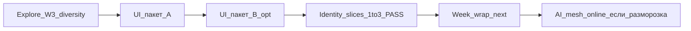
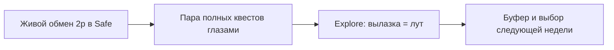

# Realm of Spirits — план на неделю

**Окно:** 2026-08-19 → 2026-08-25 (ср–вт)  
**Якорь:** 2026-08-18 (неделя стабилизации; E1/E4 ещё не закрыты «по-человечески»)  
**Файл place (игра в Studio):** `C:\Mimo\RealmOfSpirits\RealmOfSpirits second.rbxl`  
**Откуда приоритеты:** `GOALS.md` + жёсткий порядок в `NEXT-SESSION.md`

---

## Цель недели (одна фраза)

Сначала **доказать обмен между двумя игроками в Safe** своими руками, слегка подкрепить «полный квест от спавна до сдачи», затем один крупный кусок продукта — **Explore: вылазка даёт лут**, чтобы мир за дверью ощущался наградой, а не пустым фармом.

---

## Где мы сейчас

Прошлая неделя (12–18.08) сделала много «ощутимого» для игрока:

- В бою можно нормально жать **не только первую кнопку навыка** (SkillIndex = номер кнопки 1 / 2 / 3) — это закрыто.
- **Haven** (уютный хаб-магазин) за ~минуту читается: **Мика** (NPC с квестами) открывается быстро, выход в мир понятен, музыка в Safe и в бою есть.
- Обмен между игроками: Solo/SimulateSwap был зелёный; **живой 2p в Safe — E4 PASS** (user 2026-08-19). Explore дни unlocked.

Что значит **CONDITIONAL** / **PASS** простыми словами:

| Метка | Для человека |
|-------|----------------|
| **E1 CONDITIONAL** | Автотесты «квест → ловля → бой → сдача» ок, но мы **не** прошли это глазами игрока много раз подряд в обычном запуске. Риск: редкий глюк всплывёт только в живой игре. |
| **E4 PASS** (2026-08-19) | User подтвердил живой обмен **2 Players** Local Server в Safe (`/tradetest` + live swap). P1 Social gate для недели **закрыт** → Explore unlocked. |
| **PASS** (E2, E3, E5) | Игрок уже может это увидеть и пощупать; документы и сохранение place в порядке. |

**Safe** = безопасная зона магазина/хаба (Haven), где нет «уличного» боя и где разрешён обмен.  
**Local Server 2 Players** = в Roblox Studio два окна одной игры на одном ПК (как два друга рядом).  
**e2e** = пройти сценарий **от начала до конца** (спавн → квест → ловля → бой → сдача).  
**toast** = короткая всплывающая подсказка на экране.

---

## Exit criteria недели (что должен увидеть игрок)

| # | Критерий | Как проверить глазами |
|---|----------|------------------------|
| **W1** | Обмен 2 игроков в Safe — **PASS** (2026-08-19 user) | Local Server **2 Players** → оба в Safe → `/tradetest` → live swap |
| **W2** | Полный цикл квеста не развален | Хотя бы **2–3** живых прогона: спавн → Мика → ловля → бой (кнопки 1 и 2) → сдача. Честно: «5 из 5» только если останется время |
| **W3** | Explore: вылазка чувствуется наградой | За ≥3 мин в мире снаружи Safe игрок **подбирает лут** или двигает побочный прогресс; первый лут желательно ≤4 мин; видно ≥2–3 разных типа награды |
| **W4** | Place сохранён, план недели отмечен | После правок в Studio — **Ctrl+S**; в конце недели — короткие заметки «что увидели» |

**Не цель недели:** красивый декор Haven, онлайн AI-меши, сезоны PvP, новые огромные зоны.

---

## День за днём

### Ср 19.08 — Must start: закрыть E4 (живой обмен) — **Done / PASS**

**Прогресс 19.08:** MCP Solo regress **PASS** (SimulateSwap item/cosmetic, empty/missing reject, Safe attr, `/tradetest` toast, Request unknown/self).  
**Live 2p:** user-confirmed **E4 PASS** (2026-08-12/19) — Local Server **2 Players**, Safe, `/tradetest`, live swap. **Не MCP.** Чеклист: `SESSION-2026-08-19.md`. Hotfix не нужен.

**Зачем:** без этого нельзя честно сказать «Social готов» и нельзя спокойно уходить в большой новый трек. → **закрыто.**

**Чеклист человеку (архив — выполнен):**

1. Открыть place → **Ctrl+S** (на всякий случай).
2. Запуск: **Test** → поставить **Players: 2** → **Local Server** (появятся два окна игрока).
3. Оба персонажа стоят в **Safe** (Haven), рядом друг с другом.
4. В чате Studio на **обоих** окнах: команда `/tradetest` — выдаёт тестовый набор (ловушка, зелье, косметика).
5. **Обмен предметом:** один предлагает ловушку, другой — зелье (один слот) → Accept → у обоих вещи поменялись, появился toast.
6. **Обмен косметикой** отдельно тем же способом (если набор есть).
7. По желанию проверить «отказы»: далеко друг от друга / не в Safe / пустое предложение → должен быть отказ и toast, без поломки инвентаря.
8. Если всё ок — в дневнике сессии и в CHANGELOG одна строка: **E4 PASS**. Если нет — только чинить обмен, **не** начинать Explore.

**Done when:** ~~два живых клиента обменялись в Safe; E4 больше не CONDITIONAL.~~ → **PASS 2026-08-19 (user).** Explore дни (чт+) **unlocked**.

---

### Чт 20.08 — Подкрепить E1 (полный проход) + старт Explore — **Explore slice 1 Done**

**Утро / первая половина:** живые прогоны e2e (не обязательно 5 — лучше **2–3 качественных**) — *опционально; E1 всё ещё CONDITIONAL, не блокер Explore*.

1. Спавн в Haven → квест у **Мики**.
2. Выход в мир → **ловля** духа (catch).
3. **Бой:** нажать минимум SkillIndex **1 и 2**.
4. Сдача квеста, XP/монеты без странных экранов и зависших «конец боя».

**Вторая половина — Explore slice 1 (2026-08-20):** **PASS**

- Список «за 3–4 мин»: огненный кристалл **101** у Exit→Combat (highlight), дальше EmberCourt 101, сундук `(55,40)`, манга **120**.
- Видимый pickup: billboards ON + 2 funnel crystals `(8,58)` / `(28,52)`; toast + inventory grant MCP **PASS** — `SESSION-2026-08-20.md`.

**Done when:** ~~≥2 e2e без Critical; набросан короткий список~~ → список + один видимый path **Done**; e2e глазами — буфер.

---

### Пт 21.08 — Explore день 1 (видимая награда) — *slice 1 уже PASS; день = polish глазами*

**Фокус игрока:** за одну вылазку ≥3 минут что-то **найти руками** (без телепорта MCP).

1. Пройти Exit→Combat пешком: funnel crystal читается с двери.
2. Проверить: первый лут ≤4 мин (уже заложено на `(8,58)`).
3. Side 101 / трекер если Accept — не врут.
4. Вернуться в Haven — инвентарь 101 понятен.

**Done when:** тестер может сказать вслух: «я вышел, подобрал X, стало лучше» — без объяснений от разработчика.

---

### Сб 22.08 — Explore день 2 (разнообразие + стабильность) — **Done / PASS (MCP)**

1. ~~Довести до **≥2–3 типов**~~ → funnel: огонь **101**, лёд **102**, манга **120**, сундук **медь**
2. Exit toast обновлён; chest toast без `#id`
3. MCP smoke funnel parts + chest **PASS** (`SESSION-2026-08-20b-explore-diversity.md`); глазами — опционально

**Done when:** W3 близок к PASS или ясен список блокеров на буфер. → **W3 PASS (MCP)**; глазами желательно.

---

### Вс 23.08 — буфер

- Если E4/E1/Explore красные — только догон.
- Если зелёные — **UI пакет A** из очереди (toast + теги) **или** лёгкий polish / выходной.
- **Не** начинать PvP и **не** переключаться на Identity/эволюцию как основной фокус этой недели.
- **Не** online AI mesh.

---

### Пн 24.08 — стабилизация «что видит игрок»

1. Короткий регресс: Мика → ловля → бой 1+2 → сдача.
2. Ещё раз: вылазка с лутом (один прогон).
3. Если E4 чинили в среду — один быстрый повтор обмена 2p (не обязательно полный негатив-набор).
4. Заметки в SESSION: PASS / CONDITIONAL / FAIL по W1–W3.

**Done when:** нет открытых Critical; place **Ctrl+S**.

---

### Вт 25.08 — wrap + выбор следующей недели

**Прогресс к wrap (2026-08-21 checkpoint):** Explore W3 + UI A–D + HUD + Identity 1–3 уже PASS в коде/smoke. Осталось формально закрыть wrap-фразу и выбрать одно на след. неделю.

1. Итог недели в CHANGELOG / SESSION простыми словами.
2. Обновить `NEXT-SESSION.md`: что закрыто, что осталось.
3. Выбор **следующей** крупной темы (только одно):
   - live e2e буфер (E1 глазами), если хочется уверенности перед масштабом;
   - Sanctum / Resonant polish (рядом с offline mesh);
   - **PvP slice** — только если ядро и честный бой ощущаются стабильными (по GOALS PvP — после крепкого P0);
   - Explore polish — только точечно (W3 уже PASS).

**Done when:** есть одна фраза «на следующей неделе делаем X».  
**См.:** `SESSION-2026-08-21-checkpoint.md`

---

## Очередь «когда гармонично» (не эта неделя как основной фокус)

Владелец (2026-08-12): **UI-пакет** и **online AI-меши** поставить в очередь на самое удачное место по развитию — не форсить сейчас.

| # | Тема | Когда вставлять | Почему так |
|---|------|-----------------|------------|
| **Q1** | **UI пакет A** (очередь toast + тег «зачем» в сумке) | **Done 2026-08-20c** | ToastRouter + GetWhyTag |
| **Q2** | **UI пакет B** (chip «следующий шаг») | **Done 2026-08-20d** | NextStepChip Мика→Exit→лут |
| **Q3** | Крупный трек след. недели | **Identity slices 1–3 PASS** (2026-08-21); **week wrap next** | `SESSION-2026-08-21-checkpoint.md` |
| **Q4** | **UI пакет C** (mobile safe area + лёгкий CD fill + dim Catch) | **Done 2026-08-20e** | insets + CdFill + Catch dim |
| **Q5** | **UI пакет D** (grid сумок) | **Done 2026-08-20g** | `BagContentUI` grid + detail; ItemCatalog icon/rarity |
| **Q6** | **Online AI-меши** (GenerationService → Publish → MeshAssetId) | Только после: W3 не красный + **UI A** (toast-дисциплина) + явная фраза владельца **«разморозить AI mesh»**; идеально рядом с фокусом **Sanctum / Resonant / Identity-вид** | Сейчас офлайн placeholder достаточно; online отвлекает от «что чувствует игрок»; Resonant без вечного AssetId уже не ломает spawn |

Ссылки: `UI-DESIGN-REVIEW-2026-08-12.md` (пакеты A–D), `SPIRIT-AI-MESH.md` (отложено + офлайн).

**Правило:** пока Q1 не в работе — не начинать AI mesh и не тащить C/D параллельно с Explore diversity.

---

## Почему после E4 берём Explore (а не Identity / PvP)

По `GOALS.md` после Social логичный продуктовый акцент — **смысл вылазки (Explore)**: лут и побочный прогресс видны игроку сразу. Identity (эволюция/ранг) в целях уже отмечалась сильной; PvP — «масштаб после ядра», и при ещё не закрытом живом e2e рискованно как главный фокус. Explore даёт самый заметный «вайб игры» за дверьми Haven.

---

## Вне scope (не делаем как основной фокус)

| Не делаем | Почему простыми словами |
|-----------|-------------------------|
| Спам декора Haven (новые полки, ковры, «ещё красивее») | Хаб уже читается; украшения не закрывают обмен и лут |
| Онлайн AI-меши / массовый импорт моделей | Отвлекает от «что чувствует игрок в игре» |
| Большие новые зоны / Tourbillon polish | Слишком широко на одну неделю |
| Сезоны PvP, гильдии | Слишком рано, пока живой обмен и лут не доказаны |
| Параллельно два крупных трека | Размазывает неделю; один трек после E4 |

---

## Риски простым языком

| Риск | Что сделать |
|------|-------------|
| Забыли **Ctrl+S** после правок в Studio | После каждого блока работы — сохранить; не закрывать Studio «на авось» |
| «Почти работает» путают с PASS | Simulate / один игрок ≠ два окна. E4 только после живого 2p |
| Ушли в декор Haven | Вернуться к чеклисту W1→W3 |
| Не хватило времени на 5× e2e | Нормально: зафиксировать 2–3 честных прогона + баги; не врать в отчёте |
| Сломали обмен, чиня лут | В понедельник снова быстрый 2p trade smoke |

---

## Трекинг

- Каждый день: 3–5 строк в `SESSION-2026-08-XX.md` («что увидел игрок», PASS/FAIL).
- Недельный итог: блок в CHANGELOG `[Unreleased]` — **E4 live 2p** / **Explore loot feel**.
- Перед работой всегда читать `NEXT-SESSION.md`, затем этот файл.

---

## Week wrap (2026-08-22) — Done when

**Итог одной фразой:** неделя закрыла обмен, вылазку-лут, UI-пакет и Identity 1–3; игрок уже видит «новый удар + новый вид» на эволюции.

**На следующей неделе делаем Sanctum/Resonant LOOK:** после синтеза игрок видит нового Ками (имя, 3 удара, вид от родителей).

| Exit | Факт |
|------|------|
| W1 | PASS 19.08 |
| W3 | PASS 20.08b |
| UI + HUD | PASS / FIXED 20.08 |
| Identity 1–3 | PASS 21.08 |
| W2 e2e ×N | CONDITIONAL — буфер |
| LOOK code + smoke | **PASS** 22.08b (`Ками-Глыба vid #11`) |

Не делаем на старте след. недели: online AI mesh, PvP, декор Haven.
