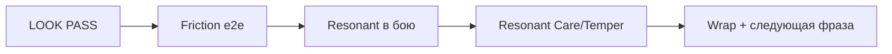

# Realm of Spirits — план на неделю

**Окно:** 2026-08-26 → 2026-09-01 (ср–вт)  
**Якорь:** 2026-08-14 вечер — LOOK + E1 3/3 + MCP V/Keypad в SoT; буфер закрыт планом  
**Place SoT:** `C:\Mimo\RealmOfSpirits\RealmOfSpirits second.rbxl`  
**Откуда приоритеты:** `GOALS.md` (P0 soft polish) + закрытая неделя LOOK (`SESSION-2026-08-22-week-wrap.md`, e2e `SESSION-2026-08-14-e1-e2e.md`)

---

## Цель недели (одна фраза)

Сделать так, чтобы **Resonant после синтеза не только «выглядел»**, а **жил в цикле**: активный Ками → бой (слот 1 читается) → уход или закалка → снова Sanctum — плюс убрать заметный friction P0 из последних e2e.

---

## Где мы сейчас

Неделя 19–25.08 (и дожим 14.08): E4 / Explore W3 / UI A–D / Identity 1–3 / **Sanctum LOOK** / E1 **3 live-like цикла** — закрыты по коду и SoT.

| Метка | Смысл |
|-------|--------|
| E1 **3 цикла PASS** / CONDITIONAL | MCP/live-like ок; метрика ≥90% n≥10 руками — **нет** (не цель этой недели целиком) |
| LOOK **PASS** | Имя, 3 удара, `vid`, `[R]`, parent mesh preview |
| MCP | Бой **V**, навыки **Keypad1–3**; игрок **F / 1 / 2** |

**Не цель недели:** online AI mesh, PvP, гильдии, декор Haven, новые огромные зоны.

---

## Exit criteria недели (что должен увидеть игрок)

| # | Критерий | Как проверить |
|---|----------|----------------|
| **W1** | Friction P0 из e2e не ломает лут/бой | Кристалл 120: **E** без ручного `Enabled=true`; бой F или V → 1+2 (или Keypad) → победа |
| **W2** | Resonant в бою | Синтез → активный Ками → дикий бой → в логе/UI удар **слота 1** Resonant (не «чужой» шаблон) |
| **W3** | Resonant в уходе | Care **или** Temper на Resonant → понятный toast/UI (не молчание) |
| **W4** | Docs + SoT | **Ctrl+S**; дневник сессии; CHANGELOG; git commit осмысленных docs/mirrors |

---

## День за днём (скелет)

### Ср 26.08 — Friction pass (W1)

1. Открыть **SoT** (не AutoRecovery).  
2. Play: путь Мика Q7 → Exit манга **E** → сдача. Если prompt снова `Enabled=false` до сбора — **чинить WorldLoot / клиент**, не «включить руками».  
3. Бой: **F** руками или MCP **V** + Keypad1/2.  
4. Заметка: FEFF `user_RoS_ShortGrass` — plugin вне place; не блокер, не чинить в SoT.

**Done when:** один честный loot+бой без MCP-костылей на prompt.

### Чт 27.08 — Resonant → бой (W2)

1. Sanctum: SeedQA / синтез 2 духов → LOOK ok.  
2. Сделать Resonant активным (roster / sync).  
3. Бой с диким: слот 1 = signature Resonant (имя навыка совпадает с LOOK `*`).  
4. Если бьёт шаблон родителя без SkillIds Resonant — чинить `BuildPlayerAbilities` / ActiveSpirit.

**Done when:** один бой, где слот 1 = Ками из синтеза.

### Пт 28.08 — Resonant → Care/Temper (W3)

1. Уход или закалка на Resonant.  
2. Toast / progress UI читаются.  
3. Не ломаем LOOK roster `[R]`.

**Done when:** один проход Care **или** Temper на Resonant с видимым фидбеком.

### Сб–вс 29–30.08 — Soft polish буфер

- Мелкие баги W1–W3.  
- Опционально: ещё 1 e2e глазами (не раздувать в n≥10).  
- Не начинать AI mesh / PvP.

### Пн–вт 31.08–01.09 — Week wrap

- Таблица W1–W4.  
- Фраза **на следующую** неделю (одно предложение).  
- `NEXT-SESSION.md` + CHANGELOG.

---

## Почему эта тема (а не PvP / AI mesh)

По `GOALS.md` после закрытых P1-кусков логичен **P0 soft polish** и углубление уже сделанного Identity/Sanctum — игрок должен **пользоваться** Ками, а не только видеть карточку. P2 (арена/гильдии) и online AI mesh — позже.

---

## Вне scope

| Не делаем | Почему |
|-----------|--------|
| Online AI mesh | Deferred; не мешать циклу Ками |
| PvP / сезоны | P2 после ядра |
| Декор Haven | Хаб уже читается |
| Метрика e2e n≥10 | Отдельный play-test спринт, не эта неделя целиком |

---

## Трекинг

- День: 3–5 строк в `SESSION-2026-08-XX.md`.  
- Неделя: блок в CHANGELOG `[Unreleased]`.  
- Перед работой: `NEXT-SESSION.md` → этот файл.  
- Git: коммитить docs/mirrors после осмысленного куска (**всегда**); не коммитить `.rbxl` / `.tmp_extract`.
