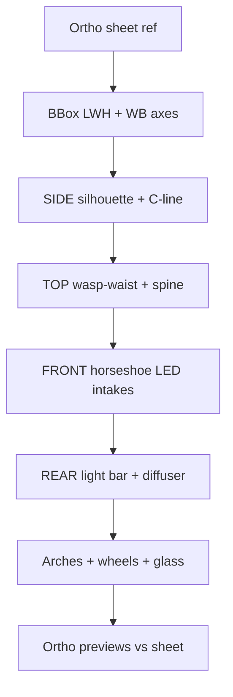

# Bugatti Tourbillon — единое ТЗ (Blender / game-ready)

Версия: **2026-07-19d**  
Статус: переработано по **orthographic sheet** (side / front / rear / top) + размеры с листа  
Цель: один силуэт в заводских габаритах; функциональные узлы без «плавающих» деталей.

> Робокс/игра: **без** брендовых надписей и логотипов. Форма = Tourbillon-like.

---

## 0. Главный референс (этот лист)

| | |
|--|--|
| Файл | `docs/realm-of-spirits/assets/meshes/ref/tourbillon_ortho_sheet_ref.png` |
| Содержание | 4 ортогонали (SIDE / FRONT / REAR / TOP) + габариты + текст overview |
| Роль | **Визуальный SoT пропорций** по всем проекциям |
| Калибровка | Орто-камеры в Blender 1:1 к bbox; сверять силуэт линии-к-линии с листом |

Доп. (цифры / DNA, не заменяют лист):

- [Bugatti Tech Specs PDF 06.2024](https://bugatti-newsroom.imgix.net/6675179393f6515cdb966608/technical-specifications-bugatti-TB-en.pdf) — мм SoT  
- [bugatti.com/tourbillon](https://www.bugatti.com/en/models/tourbillon)  
- Newsroom: horseshoe, C-line, spine, duotone, flying fender, diffuser, dihedral  

Шины (PDF, на листе не подписаны): **285/35 R20** F, **345/30 R21** R.

---

## 1. Размеры с листа → Blender (1 BU = 1 m)

Лист (округление до см) ↔ официальный PDF (мм):

| Параметр | Лист | PDF mm | Blender m | SoT |
|----------|------|--------|-----------|-----|
| Length | 15' 3.9" / **467 cm** | 4671 | **4.671** | PDF |
| Width | 6' 8.7" / **205 cm** | 2051 (без зеркал) | **2.051** | PDF / лист |
| Width + mirrors | — | 2165 | 2.165 | PDF (зеркала могут выступать) |
| Height | 3' 10.8" / **119 cm** | 1189 | **1.189** | PDF |
| Wheelbase | 8' 11.9" / **274 cm** | 2740 | **2.740** | PDF / лист |
| Curb weight | 4398 lb / 1995 kg | &lt;1995 kg DIN | — | справка |

**Жёсткий bbox кузова (закрыто, без зеркал):**

```
X ∈ [−1.0255, +1.0255]     # W/2
Y ∈ [−2.3355, +2.3355]     # L/2, нос = +Y
Z ∈ [0, 1.189]             # земля = низ шин
```

**Оси (центр кузова = 0):**

| | y (m) | Примечание |
|--|-------|------------|
| Передняя | **+1.386** | свес носа EST ≈ 0.95 (лист: передний overhang короче заднего) |
| Задняя | **−1.355** | свес кормы EST ≈ 0.98 |
| WB | 2.740 | центры колёс на SIDE листа |

**Шины → радиус центра:**

| | Ø m | r = z центра |
|--|-----|----------------|
| F 285/35 R20 | 0.708 | **0.354** |
| R 345/30 R21 | 0.740 | **0.370** |

На SIDE листа колёса **крупные**, заполняют арки (тонкий зазор арка↔шина).

---

## 2. Что лист задаёт как «лицо» Tourbillon

Сводка с чертежа + текст overview:

1. **Низкий stance** — высота ~119 cm (человек на листе: крыша ~ середина торса).  
2. **C-line** на SIDE — A-pillar → крыша → вниз в side intake → вперёд по порогу.  
3. **Horseshoe** на FRONT — крупная центральная подкова + боковые intakes.  
4. **Slim horizontal LEDs** на FRONT — у внешних верхних кромок фасции.  
5. **Full-width rear light bar** на REAR — волнистая линия по контуру палубы.  
6. **Deep diffuser** на REAR — нижняя треть.  
7. **Center spine** на TOP + REAR — нос → крыша → моторный отсек.  
8. **Teardrop / wasp-waist** на TOP — широко у осей, уже у кабины, снова широко сзади.  
9. **Кабина сдвинута вперёд** (cab-forward) на SIDE.  
10. Агрессивная посадка, flowing lines (текст листа).

DNA (Newsroom, согласуется с листом): horseshoe, C-line, spine, duotone.

---

## 3. SIDE — карта моделирования

### 3.1 Что читать на листе

- Непрерывный силуэт: нос низкий → подъём к кабине → пик крыши над головой → спад к корме.  
- **C-line** — главная графика бока; внизу уходит в **side air intake**.  
- База **274 cm** между центрами колёс.  
- Передний overhang **короче** заднего.  
- Колёса: крупный диаметр, тонкий 5-spoke / V-pattern (на модели — Y/snowflake LP).  
- Клиренс минимальный (пунктир земли на листе).

### 3.2 Нормализованная длина `t = 0…1` (нос→хвост)

`y = +2.3355 − t·4.671`

| t | Зона на SIDE | Правило модели |
|---|--------------|----------------|
| 0.00–0.08 | Нос / splitter | Очень низко |
| ~0.20 | Ось F | Центр колеса; арка заполнена |
| 0.28–0.45 | Капот → лобовое | Плавный подъём, не «яма» между крыльями |
| 0.42–0.52 | Пик крыши | z → **1.189** |
| 0.52–0.60 | C vertical + intake | Заборник **внутри** C |
| ~0.71 | Ось R | Центр колеса |
| 0.74–1.00 | Длинная корма / deck | Haunch выше переднего крыла; спад к хвосту |

### 3.3 Высоты (доли H = 1.189)

| Точка | z/H | z m |
|-------|-----|-----|
| Splitter / rocker | 0.05–0.12 | 0.06–0.14 |
| Верх шины F / R | 0.60 / 0.62 | 0.71 / 0.74 |
| Пик переднего крыла | 0.78–0.84 | 0.93–1.00 |
| Капот у оси F (центр) | 0.68–0.78 | 0.81–0.93 |
| Пик крыши | **1.00** | **1.189** |
| Пик заднего haunch | 0.90–0.96 | 1.07–1.14 |
| Deck у оси R | 0.82–0.90 | 0.97–1.07 |
| Хвост / LED | 0.40–0.55 | 0.48–0.65 |

### 3.4 C-line (опорные точки EST, m)

| # | ±x | y | z | Смысл |
|---|----|---|---|--------|
| 1 | 0.84 | +0.90 | 0.75 | A-pillar |
| 2 | 0.86 | +0.45 | 1.08 | верх greenhouse |
| 3 | 0.90 | −0.15 | 1.00 | спуск |
| 4 | 0.98 | −0.50 | 0.45 | низ у intake |
| 5 | 0.92 | −0.15 | 0.22 | порог вперёд |
| 6 | 0.88 | +0.55 | 0.22 | к передней арке |

Chrome bevel ~12–18 mm. **Duotone:** снаружи/сзади C = тёмный; внутри C (нос, дверь) = светлый.

---

## 4. FRONT — карта моделирования

### 4.1 Что читать на листе

- Ширина **205 cm** по самым широким точкам кузова (арки).  
- Greenhouse уже кузова (tumblehome).  
- **Horseshoe** — доминанта центра.  
- **Slim horizontal LED** — у внешних верхних кромок фасции (не «поды»).  
- Крупные **боковые intakes** flanking horseshoe.  
- Низкий splitter / нижняя кромка.

### 4.2 Ширины (±x)

| Элемент | ±x / (W/2) | ±x m |
|---------|------------|------|
| Край кузова / арка | 1.00 | ±1.026 |
| LED cluster | 0.55–0.90 | ±0.56–0.92 |
| Side intake | 0.42–0.98 | ±0.43–1.00 |
| Horseshoe outer R | ~0.35–0.40 | ~0.36–0.41 |
| Spine | 0 | 0 |
| Зеркала (tip) | → ±1.082 | ширина 2.165 |

### 4.3 Высоты FRONT

| Элемент | z m |
|---------|-----|
| Splitter | 0.05–0.08 |
| Intakes | 0.16–0.36 |
| LED strip | 0.36–0.42 |
| Horseshoe center | 0.34–0.44 |
| Пик крыла | 0.90–1.00 |
| Низ лобового | 0.85–0.95 |
| Крыша | → 1.189 |

### 4.4 Единство морды

Капот + horseshoe + LED + intakes = **одна фасция** (flying fender: воздух под LED → side intakes).  
Лобовое: **прозрачное**, wrap; проём в `Body` обязателен.

---

## 5. REAR — карта моделирования

### 5.1 Что читать на листе

- Ширина = как FRONT (арки).  
- **Full-width light bar** — волнистая / следует верхней кромке палубы (не тонкая «палочка»).  
- **Center spine** вниз по моторному колпаку.  
- **Агрессивный deep diffuser** — ~нижняя треть высоты.  
- Центральный блок (exhaust / cooling) над диффузором.  
- Открытая корма / mid-engine, **не** седан-багажник.

### 5.2 Зоны по высоте

| Зона | z m | Содержимое |
|------|-----|------------|
| Diffuser | 0.08–0.45 | carbon, глубокий |
| Center mechanical | 0.40–0.65 | намёк LP без бренда |
| Light bar | 0.55–0.75 | emission, почти на всю ширину ±0.9…1.0 |
| Haunch / deck | 0.85–1.14 | тёмный duotone |
| Spine brake | 0.55–1.05 | узкий vertical в хребте |

Active wing на листе может быть в силуэте — в LP: заподлицо / опционально.

---

## 6. TOP — карта моделирования

### 6.1 Что читать на листе

- Длина **467 cm** нос→хвост.  
- **Teardrop / wasp-waist:** широко у F и R осей, уже у кабины.  
- **Spine** — непрерывная ось симметрии (главная ось моделирования).  
- Узкий glasshouse; сиденья ближе к центру.  
- Венты на капоте и над моторным отсеком (LP: намёки вырезами).  
- Зеркала — небольшие боковые выступы.

### 6.2 Half-width `hw(y)` EST

| y | Зона | hw m |
|---|------|------|
| +2.34 | nose | 0.48–0.55 |
| +1.39 | ось F | **1.02–1.05** |
| +0.40 | кабина | **0.86–0.92** |
| −1.36 | ось R | **1.04–1.06** (≥ F) |
| −2.34 | tail | 0.35–0.45 |

Отношение талия / арка ≈ **0.82–0.88**.

Track EST: `|x|_wheel ≈ 0.88…0.92 · (W/2)`.

---

## 7. Иерархия Blender

```
TourbillonCar                 # Empty; door_open, lights_on, dims_m=(4.671,2.051,1.189)
├── Body                      # без дверных панелей; проёмы лобового + арок
├── CLineL / CLineR
├── SideIntakeL / R
├── FrontGroup
│   ├── GrilleRim / GrilleMesh
│   ├── HoodSpine
│   ├── FrontBrowL/R + FrontIntakeL/R
│   ├── FrontSplitter
│   └── HL_* LED (4×side) + Area Light
├── Windshield                # transparent, fixed
├── SideGlassL/R              # или DoorGlass на pivot
├── DoorPivotL/R              # dihedral: Skin + Glass + Roof
├── RearGroup
│   ├── RearLED               # full-width bar (волна по контуру)
│   ├── RearSpineBrake
│   └── Diffuser
├── MirrorL/R
└── WheelFL…RR (+ Spokes)
```

Budget: **&lt; 15 000 tris**.

---

## 8. Материалы

| ID | Зона |
|----|------|
| `TourbillonPaint` | светлый фюзеляж внутри C |
| `TourbillonDark` | зад / снаружи C |
| `TourbillonCarbon` | splitter, rocker, intakes, diffuser |
| `TourbillonChrome` | C-line, spine, grille rim |
| `TourbillonMesh` | grille / intake mesh |
| `TourbillonGlass` | прозрачное лобовое + боковые |
| `TourbillonLED` / `RearLED` | фары / задняя полоса |
| `TourbillonTire` / `RimFace` / `RimDark` | шины / Y-spokes |

---

## 9. Функционал

| Узел | Поведение |
|------|-----------|
| Dihedral doors | вверх+вперёд; DoorSkin+Glass+Roof; closed = flush |
| Lights | 8× LED + Area; RearLED bar |
| Windshield | fixed, transparent; проём в Body |

---

## 10. Пайплайн по листу



1. Empty + bbox + оси + шины (как на SIDE).  
2. Body loft по SIDE×TOP.  
3. FRONT fascia flush.  
4. REAR bar + diffuser + spine.  
5. C-line + duotone + side intake.  
6. Проёмы стекла/арок; двери; колёса в арках.  
7. Орто-рендеры side/front/rear/top **поверх** листа (или рядом) → правка.  
8. FBX / `.blend`.

---

## 11. Чеклист приёмки (по листу)

- [ ] L×W×H ≈ 4.671 × 2.051 × 1.189; WB 2.740  
- [ ] SIDE: кабина вперёд; C-line→intake; колёса заполняют арки; задний overhang ≥ передний  
- [ ] FRONT: horseshoe + slim LED + side intakes; greenhouse уже кузова  
- [ ] REAR: full-width light bar + deep diffuser + spine  
- [ ] TOP: wasp-waist + continuous spine + teardrop  
- [ ] Лобовое прозрачное  
- [ ] Closed doors = цельный силуэт  
- [ ] Tris &lt; 15k; без брендинга  

---

## 12. Ограничения

| | |
|--|--|
| Габариты / WB | SoT: лист + PDF |
| Силуэты 4 проекций | SoT: **ortho sheet** |
| Track, мм петель, NURBS | нет на листе → EST / фото |
| Текст «Chiron-inspired» на листе | только контекст; модель = Tourbillon proportions |

---

*v2026-07-19d заменяет v2026-07-19c. Визуальный SoT = `ref/tourbillon_ortho_sheet_ref.png`.*
